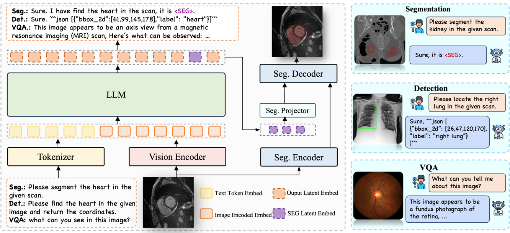
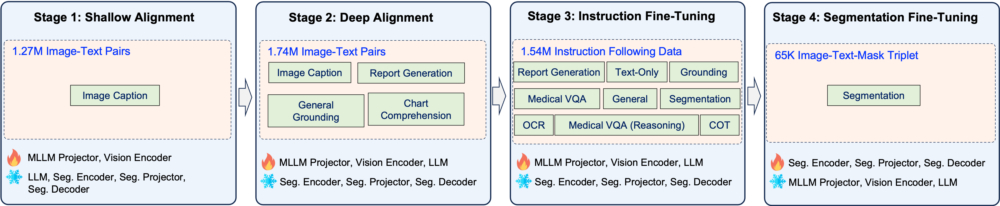

<h1 align='center'>
  Citrus-V: Advancing Medical Foundation Models with Unified Medical Image Grounding for Clinical Reasoning
</h1>

<div align='center'>
    <a target="_blank" href="" onclick="return false;">Guoxin&nbsp;Wang</a><sup>†</sup>&nbsp
    <a target="_blank" href="" onclick="return false;">Jun&nbsp;Zhao</a>&nbsp
    <a target="_blank" href="" onclick="return false;">Xinyi&nbsp;Liu</a>&nbsp
    <a target="_blank" href="" onclick="return false;">Yanbo&nbsp;Liu</a>&nbsp
    <a target="_blank" href="" onclick="return false;">Xuyang&nbsp;Cao</a>&nbsp
    <a target="_blank" href="" onclick="return false;">Chao&nbsp;Li</a>&nbsp
    <a target="_blank" href="" onclick="return false;">Zhuoyun&nbsp;Liu</a>&nbsp
    <a target="_blank" href="" onclick="return false;">Qintian&nbsp;Sun</a> <br>
    <a target="_blank" href="" onclick="return false;">Fangru&nbsp;Zhou</a>&nbsp
    <a target="_blank" href="" onclick="return false;">Haoqiang&nbsp;Xing</a>&nbsp
    <a target="_blank" href="" onclick="return false;">Zhenhong&nbsp;Yang</a>
</div>

<br>

<div align='center'>
    JDH Algo, JD Health International Inc.  
</div>

<div align='center'>
    <sup>†</sup>Project Lead
</div>

<br>

<div align='center'>
    <!-- <a href='https://github.com/jdh-algo/Citrus-V'></a> -->
    <a href='https://jdh-algo.github.io/Citrus-V/'></a>
    <a href='https://arxiv.org/abs/2509.19090'></a>
    <a href='https://huggingface.co/jdh-algo/Citrus-V-8B-v1.0'></a>
    <!-- <a href='https://huggingface.co/jdh-algo/Citrus-V-33B-v1.0'></a> -->
    <!-- <a href='https://huggingface.co/jdh-algo/Citrus-V-73B-v1.0'></a> -->
    <a href='https://huggingface.co/datasets/jdh-algo/MeCoVQA-G-Plus'></a>
    <a href='https://huggingface.co/datasets/jdh-algo/MedXray-CoT'></a>
    <a href='https://huggingface.co/datasets/jdh-algo/MedDocBench'></a>
</div>

<br>


## 📝 Introduction
Medical imaging provides critical evidence for clinical diagnosis, treatment planning, and surgical decisions, yet most existing imaging models are narrowly focused and require multiple specialized networks, limiting their generalization. Although large-scale language and multimodal models exhibit strong reasoning and multi-task capabilities, real-world clinical applications demand precise visual grounding, multimodal integration, and chain-of-thought reasoning. We introduce Citrus-V, a multimodal medical foundation model that combines image analysis with textual reasoning. The model integrates detection, segmentation, and multimodal chain-of-thought reasoning, enabling pixel-level lesion localization, structured report generation, and physician-like diagnostic inference in a single framework. We propose a novel multimodal training approach and release a curated open-source data suite covering reasoning, detection, segmentation, and document understanding tasks.  Evaluations demonstrate that Citrus-V outperforms existing open-source medical models and expert-level imaging systems across multiple benchmarks, delivering a unified pipeline from visual grounding to clinical reasoning and supporting precise lesion quantification, automated reporting, and reliable second opinions.

## 🧳 Framework



<p style="text-align:justify; text-justify:inter-word;">
    <em>
        Model architecture of Citrus-V. The framework consists of three components: 
        (1) an MLLM—including the LLM, tokenizer, and a vision encoder—for high-level visual-textual reasoning 
        such as report generation, VQA, and grounding; 
        (2) a segmentation projector that maps the "[SEG]" token produced by the MLLM into latent segmentation prompts; 
        and (3) a segmentation model that decodes the latent segmentation prompts together with semantic image features 
        into pixel-level masks. Separate image encoders are employed to decouple low-level details for segmentation 
        from high-level semantics for other tasks, ensuring both types of tasks are optimized without semantic conflict.
    </em>
</p>

## 🚧 Opensource Progress

- [x] Release Gradio/Streamlit Demo
- [ ] Release 33B Model
- [ ] Release 73B Model
- [x] Deploy & Inference


## 🛠️ Installation


To install Citrus-V:

1. Create base environment.
    ```shell
    conda create -n citrus_v python=3.10 -y
    conda activate citrus_v
    ```

2. Install requirements.
    ```bash
    git clone https://github.com/jdh-algo/Citrus-V.git
    cd Citrus-V
    pip install -r requirements_citrus.txt
    ```

3. Install [flash-attention](https://github.com/Dao-AILab/flash-attention) according to your environment. Here we used `flash-attn==2.7.3`.

4. Install Citrus-V training environment. (Based on [ms-swift](https://github.com/modelscope/ms-swift)).
    ```shell
    pip install -e .
    ```


## 🎒 Prepare Model Checkpoints

Make sure you have [git-lfs](https://git-lfs.com/) installed and download all the following checkpoints to `projects/pretrained_weights`. 

Download Citrus-V checkpoints:

```bash
git lfs install
git clone https://huggingface.co/jdh-algo/Citrus-V-8B-v1.0
```

## 📚 Prepare Your Custom Data

We recommend using the [official ms-swift documentation](https://swift.readthedocs.io/zh-cn/v3.8/Customization/%E8%87%AA%E5%AE%9A%E4%B9%89%E6%95%B0%E6%8D%AE%E9%9B%86.html) to prepare your custom training dataset.


## ⚓️ Training

<!-- ### Training Section -->
<!-- Here’s a quick example to get started with Citrus-V: this repo provides a pretrained checkpoint that has completed Stage 1 and Stage 2. The repo is designed for Stage 3 and Stage 4 training. -->
<!-- The key difference is that Stage 3 performs full-network tuning and includes the HookGrad module. Stage 4 is the SAM-adaptation phase: every component is frozen except the SegProjector and SAM modules, which are jointly updated to align segmentation prompts with the Segment-Anything paradigm. -->


<p style="text-align:justify; text-justify:inter-word;">
    <em>Four Training Stages of the Citrus-V. Concept alignment for stable vision–language mapping, comprehension enhancement for enhanced multimodal reasoning, instruction fine-tuning to strengthen instruction-following ability while encoding segmentation intent, and segmentation fine-tuning to adapt SAM2 for precise medical image segmentation. </em>
    <br>
</p>


### Training stage 1 & 2

It is recommend to train from stage 3 using the pretrained Citrus-V model.

To train the Citrus-V model from scratch, first build the original model using the following scripts:

```bash 
python architectures/build_citrus_v_model.py

```

### Training stage 3
<details>
<summary>View Complete Training Command</summary>

```shell
PYTORCH_CUDA_ALLOC_CONF=expandable_segments:True \
NPROC_PER_NODE=8 \
MIN_PIXELS=200704 \
MAX_PIXELS=1003520 \
CUDA_VISIBLE_DEVICES=0,1,2,3,4,5,6,7 \
swift sft \
    --model {pretrained ckpt address} \
    --dataset {your dataset address} \
    --template citrus_v \
    --train_type full \
    --torch_dtype bfloat16 \
    --attn_impl flash_attn \
    --max_length 12288 \
    --num_train_epochs 5 \
    --learning_rate 1e-5 \
    --warmup_ratio 0 \
    --warmup_steps 100 \
    --adam_beta1 0.9 \
    --adam_beta2 0.999 \
    --weight_decay 0.1 \
    --max_grad_norm 1.0 \
    --per_device_train_batch_size 1 \
    --gradient_accumulation_steps 8 \
    --dataloader_num_workers 64 \
    --dataset_num_proc 1 \
    --freeze_vit false \
    --freeze_aligner false \
    --freeze_llm false \
    --save_strategy epoch \
    --save_total_limit 8 \
    --logging_steps 5 \
    --output_dir {your model save path}\
    --save_only_model \
    --gradient_checkpointing true \
    --ddp_find_unused_parameters true
```

</details>

### Training stage 4
<details>
<summary>View Complete Training Command</summary>

```shell
PYTORCH_CUDA_ALLOC_CONF=expandable_segments:True \
NPROC_PER_NODE=8 \
MIN_PIXELS=200704 \
MAX_PIXELS=1003520 \
CUDA_VISIBLE_DEVICES=0,1,2,3,4,5,6,7 \
swift sft \
    --model {pretrained ckpt address} \
    --dataset {your dataset address} \
    --template citrus_v \
    --train_type full \
    --torch_dtype bfloat16 \
    --attn_impl flash_attn \
    --max_length 12288 \
    --num_train_epochs 5 \
    --learning_rate 1e-5 \
    --warmup_ratio 0 \
    --warmup_steps 100 \
    --adam_beta1 0.9 \
    --adam_beta2 0.999 \
    --weight_decay 0.1 \
    --max_grad_norm 1.0 \
    --per_device_train_batch_size 1 \
    --gradient_accumulation_steps 8 \
    --dataloader_num_workers 64 \
    --dataset_num_proc 1 \
    --freeze_vit true \
    --freeze_aligner true \
    --freeze_llm true \
    --freeze_custom_parameters_json {/path/to/projects/vlm_7B_params.json} \
    --save_strategy epoch \
    --save_total_limit 8 \
    --logging_steps 5 \
    --output_dir {your model save path}\
    --save_only_model \
    --gradient_checkpointing true \
    --ddp_find_unused_parameters true
```

</details>


## 🚀 Deploy & Inference

1. Deploy

```bash
CUDA_VISIBLE_DEVICES=0,1,2,3 \
MAX_PIXELS=65535 \
VIDEO_MAX_PIXELS=50176 \
FPS_MAX_FRAMES=12 \
swift deploy \
    --model /path/to/Citrus-V-8B-v1.0 \
    --served_model_name CitrusV_8B \
    --template citrus_v_infer \
    --infer_backend pt \
    --torch_dtype bfloat16 \
    --port 8000
```

2. Inference with Deployment

```bash 
cd projects
python inference_with_deploy.py
```

3. Inference with [ms-swift](https://github.com/modelscope/ms-swift) PtEngine

```bash 
python inference.py --model /path/to/Citrus-V-8B-v1.0
```


## 🏛 License
This project is licensed under the Apache License (Version 2.0). For models and datasets, please refer to the original resource page and follow the corresponding License.

## 📎 Citation
If you use Citrus-V in your research, please cite our work:

```bibtex
@misc{wang2025citrusvadvancingmedicalfoundation,
    title={Citrus-V: Advancing Medical Foundation Models with Unified Medical Image Grounding for Clinical Reasoning}, 
    author={Guoxin Wang, Jun Zhao, Xinyi Liu, Yanbo Liu, Xuyang Cao, Chao Li, Zhuoyun Liu, Qintian Sun, Fangru Zhou, Haoqiang Xing and Zhenhong Yang},
    year={2025},
    eprint={2509.19090},
    archivePrefix={arXiv},
    primaryClass={cs.CV},
    url={https://arxiv.org/abs/2509.19090}, 
}
```

## 🤝 Acknowledgments

We would like to thank the contributors to the [ms-swift](https://github.com/modelscope/ms-swift), [SA2VA](https://github.com/magic-research/Sa2VA), [SAM2](https://github.com/facebookresearch/sam2), [Qwen2.5-VL](https://github.com/QwenLM/Qwen2.5-VL), and [mmdetection](https://github.com/open-mmlab/mmdetection) repositories, for their open research and extraordinary work.
